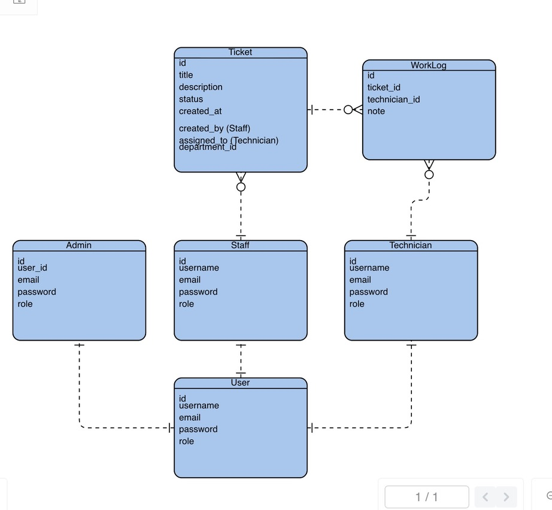

# ⚙️ MTRIX  
**Maintenance Ticketing Reporting Inspection eXecution**


---

## 🔹 Project & Repository Descriptions  

### Project Overview
**MTRIX** is a comprehensive maintenance ticketing system designed for departments and organizations. The system enables employees (Staff) to create and track maintenance tickets easily, while technicians can manage, solve, and update them efficiently. Administrators have full oversight and control over all tickets and system operations.

**Main Goals:**
- Streamline maintenance request processes
- Enable efficient ticket tracking and management
- Provide role-based access control (Admin, Staff, Technician)
- Facilitate communication between staff and technicians through work logs
- Collect feedback through emoji-based reactions

### Repository Descriptions

**Backend Repository (Current):**
- Django REST API backend with JWT authentication
- PostgreSQL database integration
- RESTful API endpoints for tickets, work logs, reactions, and user management
- Role-based permissions and authorization
- Docker containerization support

**Frontend Repository:**
- React Single Page Application (SPA)
- Separate dashboards for Staff, Technicians, and Admins
- Modern UI with React Router for navigation
- Vite build tool for fast development and production builds

---

## 🔹 Tech Stack  

### Backend Technologies
- **Framework:** Django
- **API:** Django REST Framework
- **Authentication:** JWT (JSON Web Tokens) using SimpleJWT
- **Database:** PostgreSQL 16
- **Containerization:** Docker, Docker Compose
- **CORS:** django-cors-headers

### Frontend Technologies
- **Framework:** React
- **Router:** React Router
- **Build Tool:** Vite
- **HTTP Client:** Fetch API

### Development & Deployment
- **Containerization:** Docker, Docker Compose
- **Version Control:** Git, GitHub
- **Deployment:** TBD

---

## 🔹 Front End Repository Link  
👉 [Frontend Repository - GitHub](https://github.com/mahaalghuraibi/MTRIX_Frontend)

---

## 🔹 Backend Repository Link  
👉 [Backend Repository - GitHub](https://github.com/mahaalghuraibi/MTRIX_backend)

**Backend Live Site:**  
🔗 [_website url_](http://localhost:8000//)


---

## 🔹 ERD Diagram  



### Database Models

**User Model (Django Built-in):**
- Stores authentication credentials (username, password)
- Base model for all system users

**Profile Model:**
- One-to-One relationship with User
- Stores user role: `Admin`, `Staff`, or `Technician`
- Tracks creation and update timestamps

**Ticket Model:**
- Created by Staff users
- Fields: `title`, `description`, `status`, `created_at`
- Foreign key relationship to User (creator)
- Status can be: Open, In Progress, Resolved, Closed, etc.

**WorkLog Model:**
- Linked to a Ticket (Many-to-One)
- Contains technician work details
- Fields: `date`, `type` (Fix/Check/Replace), `note`, `technician_id`
- Ordered by date (newest first)

**Reaction Model:**
- Linked to a Ticket (Many-to-One)
- Represents staff feedback on ticket resolution
- Fields: `score` (emoji: 😐, 🙂, 🤩), `staff_id`, `created_at`

### Entity Relationships Summary
- **User** ↔ **Profile** (1:1) - Each user has one profile
- **User (Staff)** → **Tickets** (1:M) - One staff member can create many tickets
- **Ticket** → **WorkLogs** (1:M) - One ticket can have many work logs
- **Ticket** → **Reactions** (1:M) - One ticket can have many reactions
- **WorkLog** references `technician_id` (IntegerField)
- **Reaction** references `staff_id` (IntegerField)

---

## 🔹 Routing Table (API Endpoints)

All endpoints require JWT authentication unless otherwise specified. Include the token in the Authorization header: `Authorization: Bearer <token>`

| Method | Endpoint | Description | Authentication | Permissions |
|--------|----------|-------------|----------------|-------------|
| GET | `/` | API home/welcome message | ❌ No | Public |
| GET | `/tickets/` | List all tickets | ✅ Yes | Admin/Technician: see all<br>Staff: see own tickets only |
| POST | `/tickets/` | Create a new ticket | ✅ Yes | Staff, Admin |
| GET | `/tickets/<ticket_id>/` | Get ticket details by ID | ✅ Yes | Admin/Technician: all<br>Staff: own tickets only |
| PUT | `/tickets/<ticket_id>/` | Update a ticket | ✅ Yes | Admin/Technician: all<br>Staff: own tickets only |
| DELETE | `/tickets/<ticket_id>/` | Delete a ticket | ✅ Yes | Admin/Technician: all<br>Staff: own tickets only |
| GET | `/tickets/<ticket_id>/worklogs/` | List all work logs for a ticket | ✅ Yes | Authenticated users |
| POST | `/tickets/<ticket_id>/worklogs/` | Add a work log to a ticket | ✅ Yes | Technicians, Admin |
| GET | `/tickets/<ticket_id>/reactions/` | List all reactions for a ticket | ✅ Yes | Authenticated users |
| POST | `/tickets/<ticket_id>/reactions/` | Create a reaction for a ticket | ✅ Yes | Staff, Admin |
| GET | `/reactions/` | List all reactions in the system | ✅ Yes | Authenticated users |
| GET | `/reactions/<reaction_id>/` | Get a single reaction by ID | ✅ Yes | Authenticated users |
| PUT | `/reactions/<reaction_id>/` | Update a reaction | ✅ Yes | Staff: own ticket reactions<br>Admin: all |
| DELETE | `/reactions/<reaction_id>/` | Delete a reaction | ✅ Yes | Staff: own ticket reactions<br>Admin: all |
| POST | `/users/<user_id>/profile/` | Create or update profile for a user | ✅ Yes | Admin, or own profile |
| PUT | `/profile/update/` | Update current user's profile role | ✅ Yes | Own profile only |
| POST | `/users/signup/` | Register a new user account | ❌ No | Public |
| POST | `/users/login/` | Login with username and password | ❌ No | Public |
| GET | `/users/token/refresh/` | Refresh or verify JWT token | ✅ Yes | Authenticated users |

### Base URL
- **Local Development:** `http://localhost:8000`
- **Production:** 


---

## 🔹 Installation Instructions (Docker)

### Prerequisites
- Docker 
- Docker Compose 
- Git

---

### 🐍 Backend Setup

1. **Clone the repository:**
   ```bash
   git clone https://github.com/mahaalghuraibi/MTRIX_backend.git
   cd MTRIX_backend
   ```

2. **Create environment file:**
   ```bash
   # Create .env.dev file in the backend directory
   # Copy from example or create with the following variables:
   # SECRET_KEY=your-secret-key-here
   # SQL_ENGINE=django.db.backends.postgresql
   # SQL_DATABASE=MTRIX_django_dev
   # SQL_USER=docker_django_user
   # SQL_PASSWORD=hello_django
   # SQL_HOST=db
   # SQL_PORT=5432
   ```

3. **Start the database service:**
   ```bash
   docker compose up -d db
   ```

4. **Build and start the API service:**
   ```bash
   docker compose up -d api
   ```

5. **Run database migrations:**
   ```bash
   docker compose exec api python manage.py migrate
   ```

6. **Create a superuser (admin account):**
   ```bash
   docker compose exec api python manage.py createsuperuser
   ```

7. **Access the API:**
   - API will be available at: `http://localhost:8000`
   - Django Admin panel: `http://localhost:8000/admin`

---

### ⚛️ Frontend Setup

1. **Clone the frontend repository:**
   ```bash
   git clone https://github.com/mahaalghuraibi/MTRIX_Frontend.git
   cd MTRIX_Frontend
   ```

2. **Create environment file:**
   ```bash
   # Create .env file in the frontend directory
   # Add the following:
   VITE_API_BASE=http://localhost:8000
   ```

3. **Install dependencies:**
   ```bash
   npm install
   ```

4. **Start development server:**
   ```bash
   npm run dev
   ```

5. **Access the frontend:**
   - Frontend will be available at: `http://localhost:5173`

---

### 🧩 Run Everything Together (Optional)

If you want to run both backend and frontend services together:

```bash
# From the root directory (with docker-compose.yml)
docker compose up -d

# View logs
docker compose logs -f api
docker compose logs -f db

# Run migrations if needed
docker compose exec api python manage.py makemigrations
docker compose exec api python manage.py migrate
```

### 🛑 Stopping Services

```bash
# Stop all services
docker compose down

# Stop and remove volumes (⚠️ This will delete database data)
docker compose down -v
```

---
## 🔹 IceBox Features (Future Enhancements)

- 📊 Dashboard with ticket analytics and charts  
- 🎯 Ticket priority levels (Low, Medium, High)  
- 🔔 Real-time notifications for updates and new tickets  
- 🔍 Advanced search and filters (by status, technician, or date)  
- 📱 Mobile-friendly version and future mobile app

